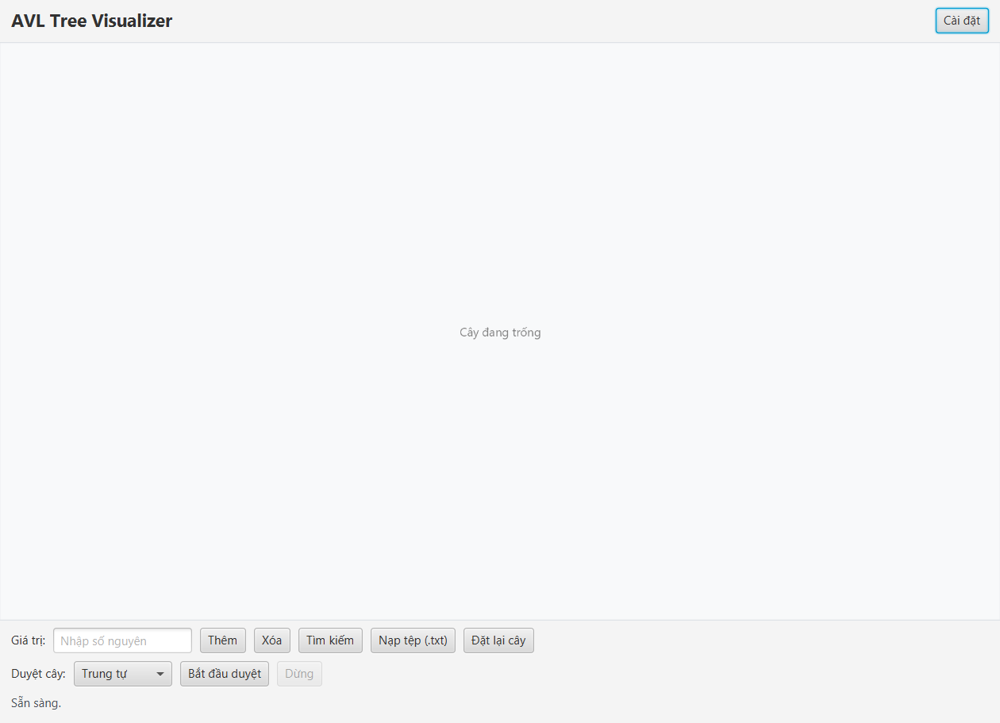

# AVL Tree Visualizer

A desktop application that visualizes an AVL tree and its core operations (insert, delete, search, traversal) with step-by-step animations, built with JavaFX.



## Download & Installation

Grab the latest release from the [Releases](https://github.com/zHe11Catz/AVLTreeVisualizer/releases) page.

### Installer (.exe)

1. Download `AVLTreeVisualizer-Setup-x.x.x.exe`.
2. Run the file and follow the setup wizard.
3. Once installed, you'll get a Start Menu shortcut and can uninstall it like any other program.

### Portable

1. Download `AVLTreeVisualizer-Portable-x.x.x.zip`.
2. Extract it to any folder.
3. Run `AVLTreeVisualizer.exe` inside the extracted folder.

### System Requirements

- Windows 10/11 (64-bit).
- **No separate Java/JDK installation needed** — a Java Runtime Environment (JRE) is bundled with the app.
- Minimum screen resolution: 1024×768.

## Key Features

- **Insert / Delete / Search** nodes with animations illustrating each comparison, movement, and AVL rebalancing step (single/double rotations).
- **Tree traversal** in 4 orders: Inorder, Preorder, Postorder, Level-order — with animated highlighting of each visited node.
- **Import from a .txt file** to build the tree from a batch of values.
- **Animation settings**: toggle animation on/off, choose speed (Slow / Normal / Fast).
- **Automatic save & restore of tree state** — close and reopen the app without losing your tree, no database required.
- **Stop mid-operation** while an animation is running, safely rolling back to the previous tree state.

[//]: # (![Insert demo]&#40;docs/screenshot-insert.gif&#41;)

## Build from Source

Full guide coming later...

[//]: # (Requirements: JDK 25, Apache Maven, JavaFX SDK 25.0.4.)

[//]: # ()
[//]: # (```bash)

[//]: # (git clone https://github.com/zHe11Catz/AVLTreeVisualizer.git)

[//]: # (cd AVLTreeVisualizer)

[//]: # (mvn javafx:run)

[//]: # (```)

[//]: # ()
[//]: # (To package a Windows installer &#40;.exe&#41;, see the `build-release.bat` script &#40;requires WiX Toolset v3&#41;.)

[//]: # ()
[//]: # (## License)

[//]: # ()
[//]: # ([Add license here, e.g. MIT])